<p align="center">
  
</p>

<h1 align="center">Vexis</h1>

<p align="center"><strong>Plataforma de gestión integral para automoción</strong></p>

<p align="center">
  
  
  
  
  
  
  
</p>

<p align="center">
  <a href="https://vexis-app.duckdns.org/"></a>
</p>

Vexis es una aplicación web interna construida con **Laravel 12** para la gestión completa de un grupo de concesionarios: administración y estructura organizativa, área comercial y fiscal (ofertas, ventas, facturas y Verifactu), recambios, talleres, incidencias, portal de cliente con **IA (Gemini)** y analítica de negocio (**DatAxis**).

Esta rama `main` representa el **estado final y de producción** del proyecto. La documentación de cada hito se conserva en las ramas de versión: [`VX_v.1`](../../tree/VX_v.1), [`VX_v.2`](../../tree/VX_v.2) y [`VX_v.3`](../../tree/VX_v.3).

---

## Tabla de contenidos

1. [Visión general](#1-visión-general)
2. [Áreas y módulos](#2-áreas-y-módulos)
3. [Características destacadas](#3-características-destacadas)
4. [Stack tecnológico](#4-stack-tecnológico)
5. [Arquitectura](#5-arquitectura)
6. [Seguridad y control de acceso](#6-seguridad-y-control-de-acceso)
7. [Inteligencia artificial (Gemini)](#7-inteligencia-artificial-gemini)
8. [Requisitos](#8-requisitos)
9. [Instalación](#9-instalación)
10. [Desarrollo local](#10-desarrollo-local)
11. [Despliegue en producción](#11-despliegue-en-producción)
12. [Datos de demostración](#12-datos-de-demostración)
13. [Mapa de rutas](#13-mapa-de-rutas)
14. [Base de datos](#14-base-de-datos)
15. [Calidad y pruebas](#15-calidad-y-pruebas)
16. [Historial de versiones](#16-historial-de-versiones)
17. [Vista previa](#17-vista-previa)
18. [Licencia](#18-licencia)

---

## 1) Visión general

Vexis centraliza la operativa diaria de un grupo de automoción multiempresa y multicentro. Combina:

- un **back office** completo con control de acceso por roles, permisos y políticas,
- procesos **comerciales y fiscales** de extremo a extremo (de la oferta a la factura, con cumplimiento **Verifactu**),
- módulos operativos de **recambios** y **talleres**,
- gestión de **incidencias**,
- un **portal de cliente** con asistente conversacional y pre-tasación por **IA**,
- y un módulo de **analítica** (DatAxis) para la toma de decisiones.

La interfaz es **responsive** (navbar de módulos colapsable en móvil, menú de opciones unificado) y soporta **modo oscuro**.

---

## 2) Áreas y módulos

| Área | Módulos |
| --- | --- |
| **Gestión** | Usuarios, empresas, departamentos, centros, roles, permisos, restricciones, noticias, campañas, naming PCs, festivos, vacaciones, visor de logs, ajustes del sistema |
| **Comercial y fiscal** | Clientes, tipos de cliente, vehículos, ofertas, ventas (conceptos e impuestos automáticos), facturas, Verifactu, tasaciones, catálogo |
| **Recambios** | Almacenes, stock, repartos |
| **Talleres** | Talleres, mecánicos, citas, coches de sustitución |
| **Incidencias** | Tickets con archivos adjuntos y asignaciones |
| **Cliente** | Portal con campañas, precios, concesionarios, noticias, talleres, configurador, chatbot y (pre)tasación por IA |
| **Analítica (DatAxis)** | General, ventas, stock, taller, facturas, incidencias |
| **Administración** | Panel de Control IA, toggles de módulos, gestión de permisos, manual de usuario |

---

## 3) Características destacadas

- **Seguridad por capas**: autenticación con sesión, autorización por permisos y políticas, restricciones de visibilidad por usuario, cabeceras de seguridad, *rate limiting* y modo mantenimiento.
- **Activación de módulos sin tocar código**: el Super Admin habilita/deshabilita módulos (facturas, Verifactu, incidencias, ...) desde **Ajustes** mediante el middleware `module:`.
- **Cumplimiento fiscal Verifactu**: cadena de hash SHA-256, estados AEAT, XML, QR y declaración responsable.
- **Facturación completa**: facturas vinculadas a venta con PDF (datos registrales, IGIC/IVA, RGPD, reserva de dominio y garantía) y exportación.
- **IA integrada (Gemini)**: chatbot y pre-tasación en el portal de cliente, con control por permisos y *rate limiting*.
- **Panel de Control IA**: monitoriza el **uso real** de la API frente a los **límites del plan gratuito de Google** (sin tope interno), con registro persistente en `ai_usage`.
- **Visor de logs en tiempo real**: streaming, descarga y limpieza de logs de seguridad y errores.
- **Generación documental**: PDFs automáticos de documentos de vehículo e historial documental; matrícula vía **API de la DGT**.
- **UX moderna**: componentes reutilizables (filtros avanzados, orden por columnas), interfaz responsive y modo oscuro.
- **Despliegue automatizado**: scripts de *cero a producción* sobre **DigitalOcean (Ubuntu 24.04)** con DuckDNS y SSL de Let's Encrypt.

---

## 4) Stack tecnológico

### Backend

| | Tecnología | Función |
|:---:|---|---|
|  | **PHP** `^8.2` | Lenguaje del backend |
|  | **Laravel** `^12.0` | Framework de aplicación |
|  | **MySQL / MariaDB** | Base de datos relacional (o compatible) |

### Frontend

| | Tecnología | Función |
|:---:|---|---|
|  | **Vite** `^7` | Bundler y servidor de desarrollo |
|  | **Tailwind CSS** `^4` | Sistema de estilos |
|  | **Axios** | Cliente HTTP |

### Paquetes clave

- `spatie/laravel-permission` — roles y permisos
- `maatwebsite/excel` — exportaciones Excel
- `barryvdh/laravel-dompdf` — facturas y exportaciones PDF
- `spatie/pdf-to-text` — parseo de PDFs de ofertas
- `endroid/qr-code` — QR de Verifactu
- `@google/generative-ai` — chatbot y pre-tasación del módulo cliente

### Calidad

- `larastan/larastan` (PHPStan), `laravel/pint` (estilo), `phpunit/phpunit` (tests), `lighthouse` + `puppeteer` (accesibilidad)

---

## 5) Arquitectura

El proyecto sigue una arquitectura en capas sobre Laravel, reforzada con repositorios e interfaces:

- `app/Http/Controllers` — controladores por módulo
- `app/Http/Middleware` — `CheckModuleEnabled` (toggles de módulo), `MaintenanceMode`, `SecurityHeaders`
- `app/Models` — entidades de dominio (Eloquent)
- `app/Policies` — autorización por recurso
- `app/Repositories` (+ `Interfaces`) — acceso a datos desacoplado
- `app/Services` — lógica de negocio (ofertas PDF, Verifactu, IA, documentos de vehículo, ...)
- `app/Exports` — exportaciones Excel/PDF
- `database/migrations` y `database/seeders` — esquema y datos iniciales
- `resources/views` — vistas Blade
- `routes/web.php` — rutas de aplicación

En `AppServiceProvider` se registran los *bindings* de repositorios y las políticas con `Gate::policy`.

<p align="center">
  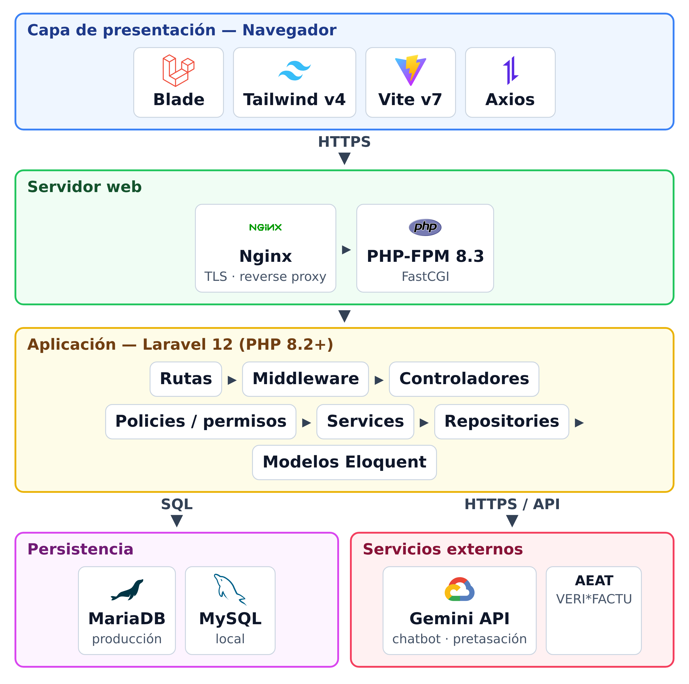
</p>

---

## 6) Seguridad y control de acceso

- **Autenticación**: login/logout con sesión y registro (`/register`), protegidos con `throttle` (*rate limiting*) y middleware `auth`.
- **Autorización**: permisos granulares por módulo (ver/crear/editar/eliminar) y políticas por recurso.
- **Roles**: `Super Admin`, `Administrador`, `Gerente`, `Vendedor`, `Consultor`, `Mecánico` y `Cliente`.
- **Restricciones de visibilidad**: modelo `user_restrictions` con soporte polimórfico para segmentar el acceso por entidad.
- **Endurecimiento**: cabeceras de seguridad, modo mantenimiento, visor de logs y *rate limiting* en endpoints sensibles (login, registro e IA).
- **Zonas Super Admin**: ajustes del sistema, gestión de permisos, visor de logs y Panel de Control IA.

---

## 7) Inteligencia artificial (Gemini)

El portal de cliente integra **Google Gemini** para dos funciones: **chatbot** de atención y **pre-tasación** asistida. Ambas están limitadas por permisos del usuario y por `throttle`.

El **Panel de Control IA** (`/ai/control`, solo Super Admin) muestra el **uso real** de la API contrastado con los **límites del plan gratuito de Google**, sin imponer un tope interno:

- **15** peticiones por minuto (RPM)
- **1 500** peticiones por día (RPD)
- **1 000 000** tokens por minuto (TPM)
- coste: **0 €** (plan gratuito, sin facturación)

El consumo se registra de forma persistente en la tabla `ai_usage`. Variables de entorno: `GEMINI_API_KEY` (y opcionalmente `GEMINI_MODEL`, `GEMINI_API_VERSION`, y claves/proyectos por feature `GEMINI_CHATBOT_*` y `GEMINI_PRETASACION_*`).

---

## 8) Requisitos

- PHP 8.2+ y Composer
- Node.js 20+ y npm
- MySQL/MariaDB
- Base de datos y variables configuradas en `.env`:
  - `DB_*` (conexión), `APP_KEY` (Artisan)
  - `GEMINI_API_KEY` (IA del módulo cliente)
  - `APP_MAINTENANCE_DRIVER` (modo mantenimiento)

Para `spatie/pdf-to-text` se necesitan utilidades del sistema para extracción de texto PDF.

---

## 9) Instalación

### Opción rápida

```bash
composer run setup
```

Instala dependencias, crea `.env`, genera `APP_KEY`, ejecuta migraciones y construye el frontend. A continuación, carga los datos iniciales:

```bash
php artisan db:seed
```

### Opción manual

```bash
composer install
cp .env.example .env
php artisan key:generate
php artisan migrate
php artisan db:seed
npm install
npm run build
```

---

## 10) Desarrollo local

```bash
composer run dev
```

Levanta en paralelo: servidor Laravel, `queue:listen`, logs con `pail` y Vite en modo desarrollo.

---

## 11) Despliegue en producción

Vexis incluye **scripts de despliegue automatizado** (*de cero a producción*) sobre **DigitalOcean (Ubuntu 24.04)**. Droplet de referencia: 1 vCPU, 2 GB RAM, 50 GB SSD (con *swap* configurado y cortafuegos `ufw`). El DNS se resuelve con **DuckDNS** (o un dominio propio) y el SSL con **Let's Encrypt**.

```
deploy/
  deploy.sh            # orquestador (de cero a producción)
  lib.sh               # helpers: detección de distro, usuario web, IP/dominio, swap
  01-install-stack.sh  # PHP, Nginx, base de datos
  02-database.sh       # base de datos y usuario
  02b-duckdns.sh       # dominio dinámico DuckDNS
  03-app.sh            # despliegue de la aplicación
  04-webserver.sh      # Nginx + PHP-FPM
  05-ssl.sh            # certificado Let's Encrypt
  update.sh            # actualizaciones posteriores
```

Configura `deploy/deploy.conf` (subdominio y token de DuckDNS, o `APP_DOMAIN`) y sigue la guía paso a paso en **`deploy/GUIA-DESPLIEGUE.md`**.

<p align="center">
  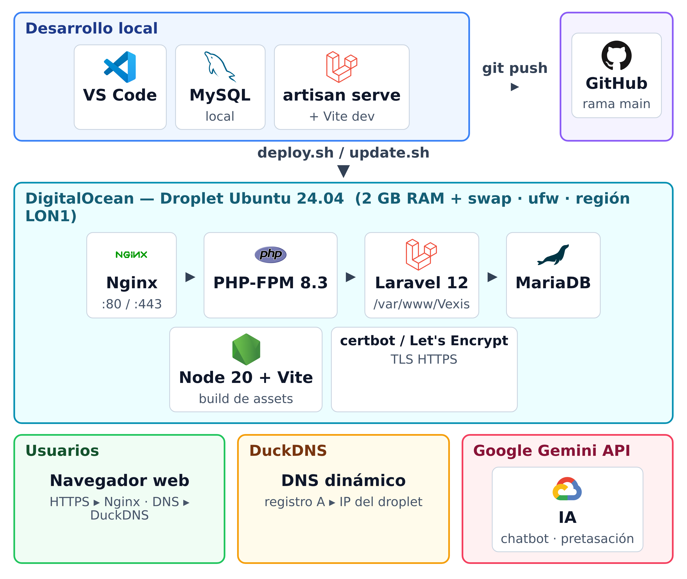
</p>

---

## 12) Datos de demostración

`php artisan db:seed` carga estructura organizativa, roles/permisos, tipos de cliente, marcas, usuarios, clientes, vehículos, catálogo, noticias, festivos, talleres, almacenes, datos de ejemplo y ajustes del sistema.

Usuarios iniciales (contraseña: `password`), dominio `@grupo-dai.com`:

| Usuario | Rol |
| --- | --- |
| `mengfei.dai@grupo-dai.com` | Super Admin |
| `carmen.santana@grupo-dai.com` | Administrador |
| `francisco.hernandez@grupo-dai.com` | Gerente |
| `maria.gonzalez@grupo-dai.com` | Vendedor |
| `pedro.cabrera@grupo-dai.com` | Consultor |

Existen usuarios adicionales por centro/rol (Tenerife, Gran Canaria, ...) para pruebas.

---

## 13) Mapa de rutas

- **Público / acceso**: `/`, `/login`, `/register`, `/dashboard`, `/manual`
- **Gestión**: `/gestion`, `/empresas`, `/users`, `/departamentos`, `/centros`, `/roles`, `/permisos`, `/restricciones`, `/noticias`, `/campanias`, `/naming-pcs`, `/festivos`, `/vacaciones`, `/gestion/logs`, `/settings`
- **Comercial y fiscal**: `/comercial`, `/clientes`, `/tipos-cliente`, `/vehiculos`, `/ofertas`, `/ventas`, `/facturas`, `/verifactu`, `/tasaciones`, `/catalogo-precios`
- **Recambios**: `/recambios`, `/almacenes`, `/stocks`, `/repartos`
- **Talleres**: `/talleres-modulo`, `/talleres`, `/mecanicos`, `/citas`, `/coches-sustitucion`
- **Incidencias**: `/incidencias`
- **IA**: `/ai/control` (Super Admin)
- **Analítica**: `/dataxis`, `/dataxis/general`, `/dataxis/ventas`, `/dataxis/stock`, `/dataxis/taller`, `/dataxis/facturas`, `/dataxis/incidencias`
- **Cliente**: `/cliente`, `/cliente/chatbot`, `/cliente/pretasacion`, `/cliente/tasacion`, `/cliente/campanias`, `/cliente/concesionarios`, `/cliente/precios`, `/cliente/configurador`, `/cliente/noticias`, `/cliente/talleres`

---

## 14) Base de datos

Sobre la estructura organizativa (`empresas`, `departamentos`, `centros`, `users`) y los catálogos comerciales (`clientes`, `vehiculos`, `oferta_cabeceras`, `oferta_lineas`), el esquema incorpora:

- **Operativa**: `almacenes`, `stocks`, `repartos`, `talleres`, `mecanicos`, `citas_taller`, `coches_sustitucion`
- **Comercial/fiscal**: `ventas`, `venta_conceptos`, `tasaciones`, `catalogo_precios`, `tipos_cliente`, `facturas`, `verifactus`
- **Gestión**: `noticias`, `campanias`, `naming_pcs`, `vacaciones`, `festivos`, `marcas`, `settings`, `user_restrictions`
- **Soporte y transversal**: `incidencias`, `vehiculo_historial_documentos`, `ai_usage`
- **Permisos**: tablas de Spatie (`roles`, `permissions` y pivotes)

La evolución del esquema está trazada en `database/migrations`.

---

## 15) Calidad y pruebas

```bash
composer run test            # batería de tests (PHPUnit)
vendor/bin/phpstan analyse   # análisis estático (larastan)
vendor/bin/pint              # estilo de código
npm run a11y                 # auditoría de accesibilidad (Lighthouse)
php artisan optimize:clear   # limpiar cachés
```

<p align="center">
  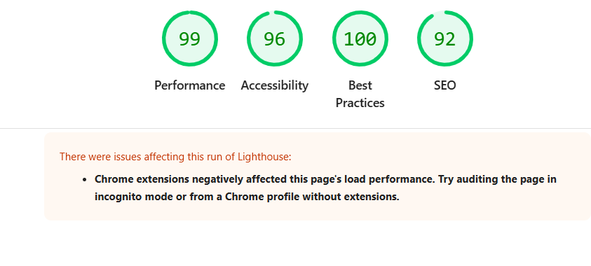
</p>

<p align="center">
  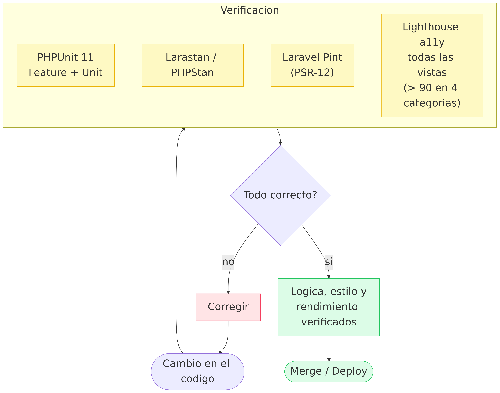
</p>

---

## 16) Historial de versiones

| Versión | Hito |
| --- | --- |
| **V1** ([`VX_v.1`](../../tree/VX_v.1)) | Núcleo de gestión, comercial base y seguridad por permisos/políticas. |
| **V2** ([`VX_v.2`](../../tree/VX_v.2)) | Recambios, talleres, ventas/tasaciones/catálogo, portal cliente con chatbot Gemini y DatAxis. |
| **V3** ([`VX_v.3`](../../tree/VX_v.3)) | Grupo DAI; facturas y Verifactu; ventas con conceptos; tipos de cliente; matrícula DGT; incidencias; toggles de módulos; Panel de Control IA; visor de logs; modo mantenimiento; *rate limiting*; despliegue automatizado. |
| **`main`** | **Producción.** V3 + despliegue en DigitalOcean (Ubuntu 24.04), Panel de Control IA con uso real frente a los límites del plan gratuito de Google, y refinamientos de UI (navbar móvil colapsable, modo oscuro). |

---

## 17) Vista previa

<table>
  <tr>
    <td width="33%">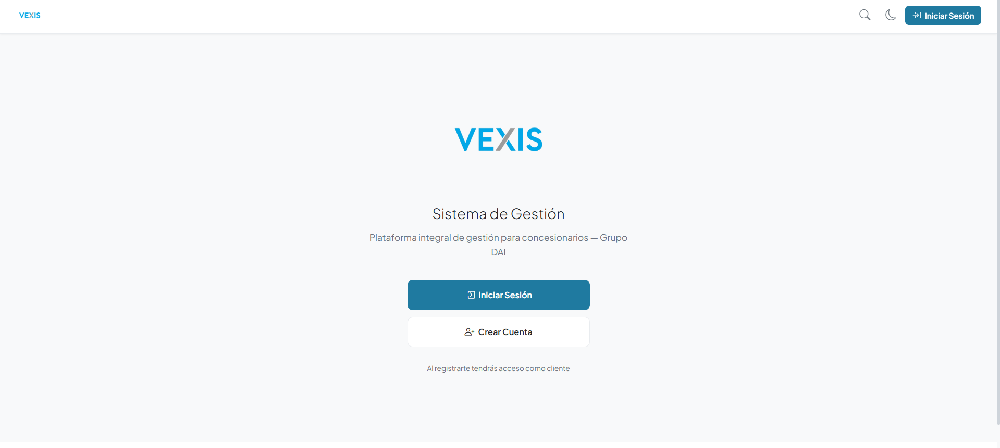<p align="center"><sub>Bienvenida</sub></p></td>
    <td width="33%">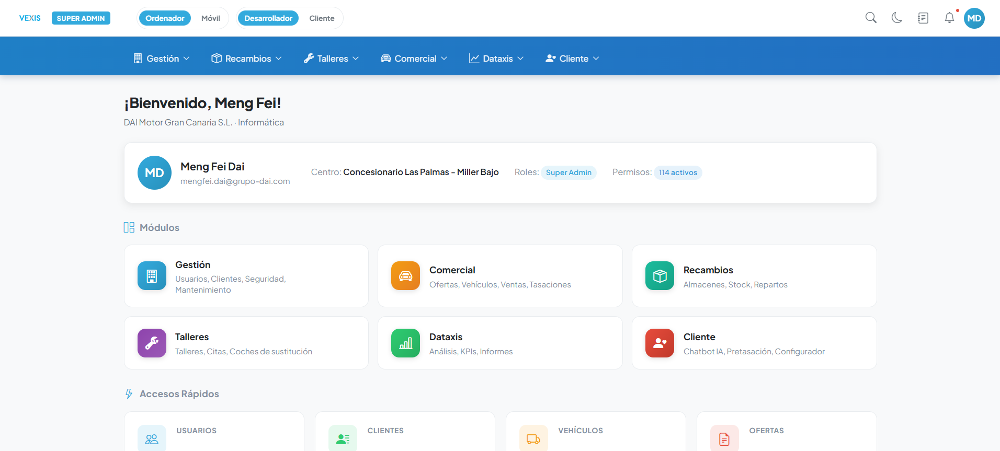<p align="center"><sub>Dashboard de módulos</sub></p></td>
    <td width="33%">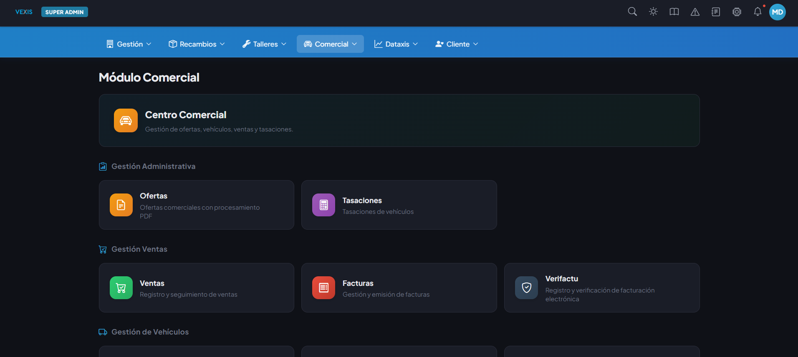<p align="center"><sub>Módulo comercial (modo oscuro)</sub></p></td>
  </tr>
  <tr>
    <td width="33%">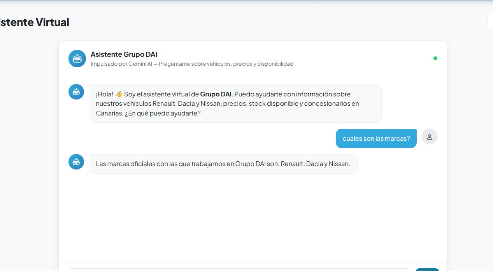<p align="center"><sub>Chatbot con Gemini</sub></p></td>
    <td width="33%">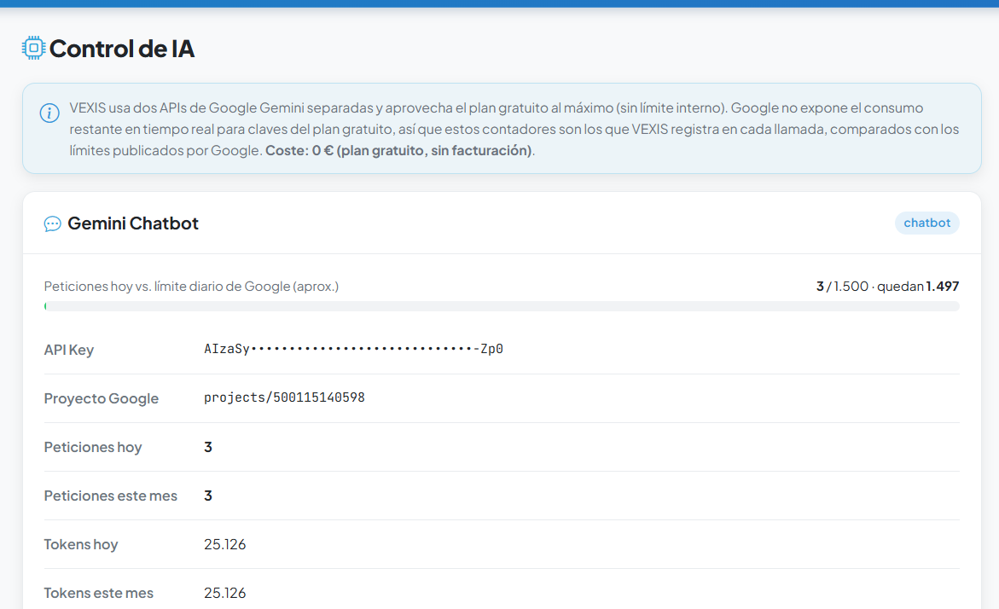<p align="center"><sub>Panel de Control IA</sub></p></td>
    <td width="33%">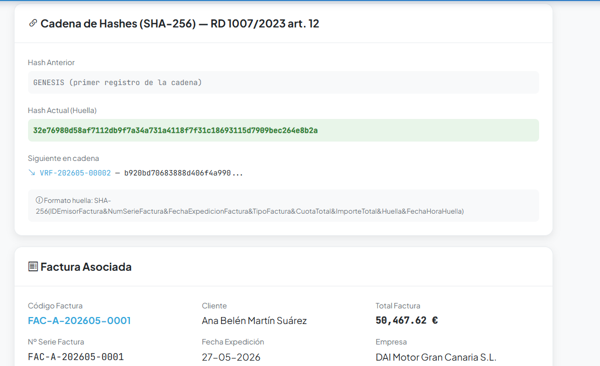<p align="center"><sub>Cadena de hashes Verifactu</sub></p></td>
  </tr>
  <tr>
    <td width="33%">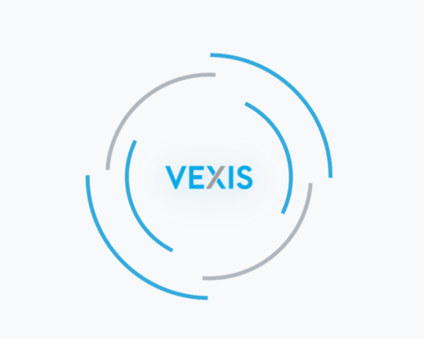<p align="center"><sub>Animación de carga</sub></p></td>
    <td width="33%">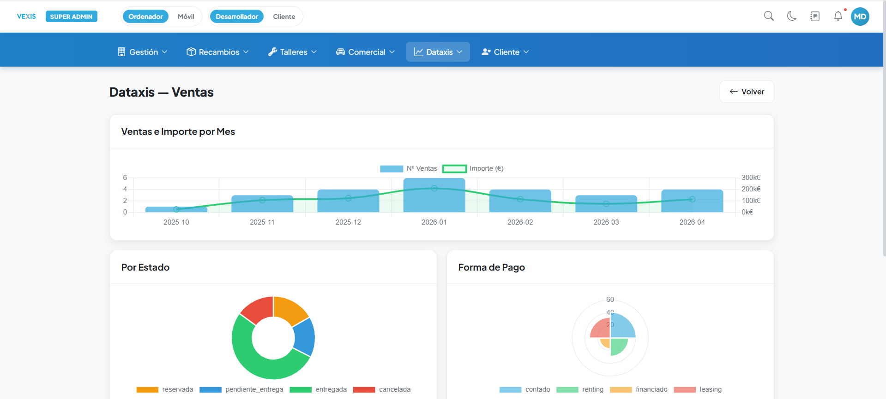<p align="center"><sub>Dataxis — Ventas</sub></p></td>
    <td width="33%">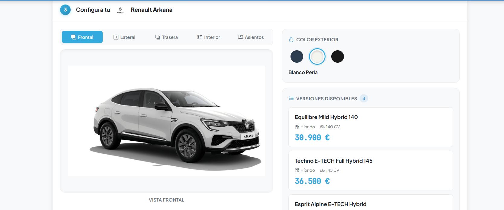<p align="center"><sub>Configurador de vehículos</sub></p></td>
  </tr>
</table>

---

## 18) Licencia

Distribuido bajo licencia **MIT** (según `composer.json`).
